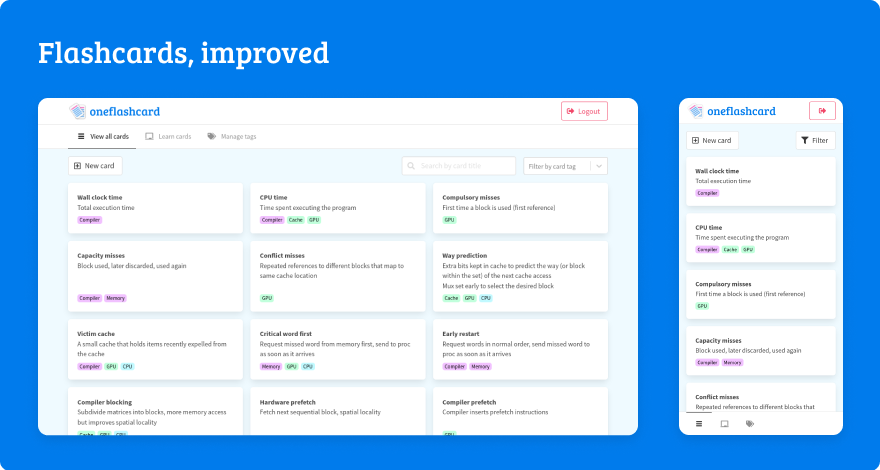
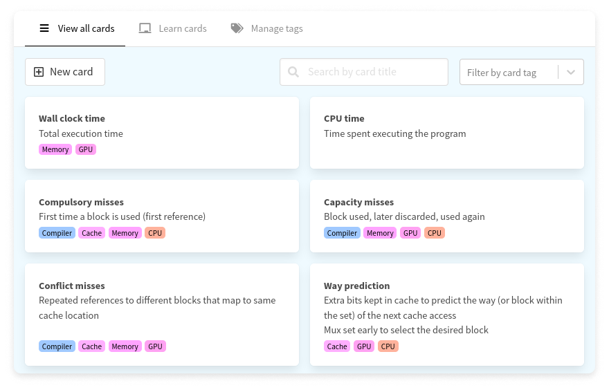
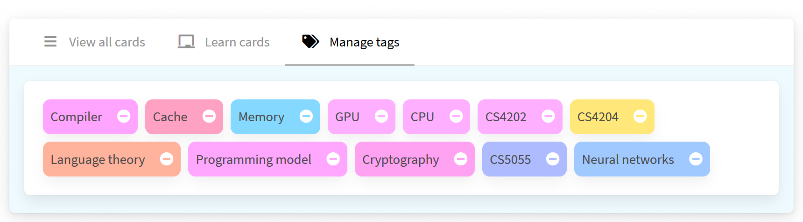
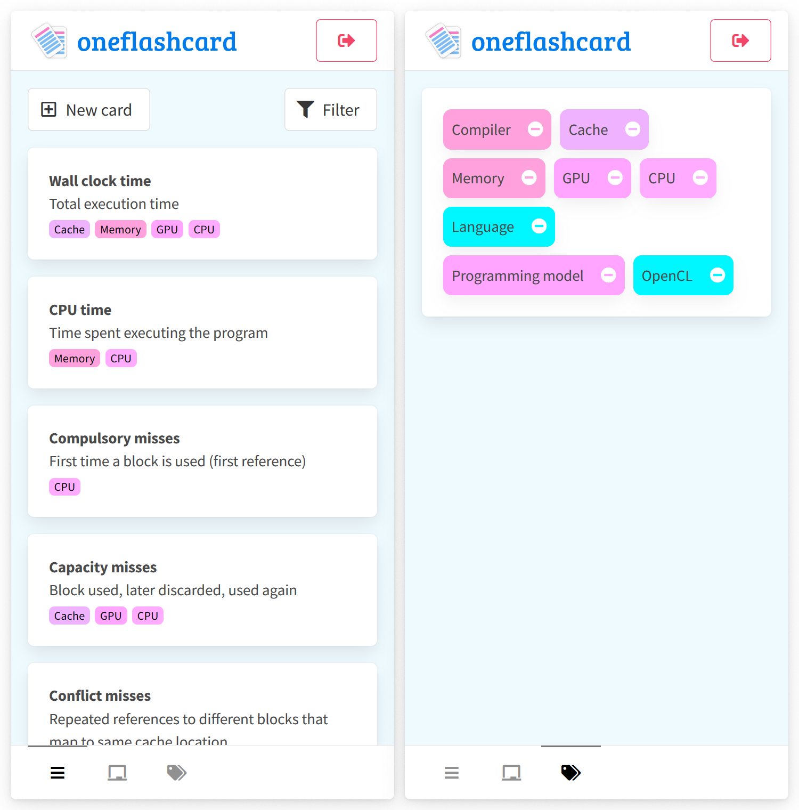

<div align="center">


[Status](#status) | [Documentation](#documentation) | [Technical details](#server) | [Contributing](#contributing) | A project by [cmcarey](https://github.com/cmcarey) 🎉

  

</div>



**oneflashcard** is a flashcard management system. Most flashcard applications only allow you to store a card in a set, with no nuance - so you cannot, for example, tag and later review only a _section_ of that set.

Oneflashcard eschews this concept of a set in favor of a system of tags; apply as many tags as you like to a card, and then later filter, review, and learn all of the cards that have a specific tag.

The application is currently in **pre-alpha** and is being developed as a personal project. I was frustrated that no flashcard application had this feature, and so I am building one 🕺.

# Features

## Card view



The **view all cards** tab allows you to view all of the cards that exist under your user. Add new cards, modify any aspect of the existing cards, and filter by card text or tags.

## Tag management



The **manage tags** tab allows you to modify tags by changing their text, color, or deleting them.

## Responsive UI



The UI is fully responsive and adapts to tablet and mobile form factors.

# CI/CD

CI/CD is performed using Github Actions.
When any branch is pushed to, workflows run which execute the integration and E2E tests for the server automatically.

# Server

The server is written in strict `Typescript` and uses `Koa` as a web backend.
Schema validation is handled automatically using `Joi`.
Password hashing and validation is performed using `bcrypt` and `10` salt rounds.
The database backend is `Postgres` and is interacted with using `knex`.

Testing is done via `Jest` and both integration and E2E tests are written.
The server is packaged for deployment using `Docker`.

The API is documented in [`API.md`](./API.md).

## Configuration

The server expects the following environment variables to be set:

| Var           | Explanation                       |
| ------------- | --------------------------------- |
| `PORT`        | Port to run the server on         |
| `DB_HOST`     | Hostname of the Postgres database |
| `DB_USER`     | DB username                       |
| `DB_PASS`     | DB password                       |
| `DB_DATABASE` | DB name                           |

## Testing

Testing is done using Jest. There are two ways to run the tests: using either the real database (E2E testing), or a mocked one (integration testing).

Using the mock database allows the tests to be run without actually needing a running database, however E2E testing is also necessary to ensure the full application functions as expected.

### Testing against mock db

```
> cd server/core
> yarn install
> yarn test.mock
# or, for reloading:
> yarn test.mock.dev
```

### Testing against real db

```
> cd server/dockerfiles
> docker-compose -f test.docker-compose.yml up -V --abort-on-container-exit
# or, for reloading:
> docker-compose -f test.dev.docker-compose.yml up -V
```

This compose brings up an auto reloading test against the current database, running all migrations in [server/database/migrations](./server/database/migrations). For each test run, all tables in the database are truncated and then data is seeded for testing.

## Status

- [x] User tests
- [x] User routes
- [x] User DB backend

<!-- -->

- [x] Card tests
- [x] Card routes
- [x] Card DB backend

<!-- -->

- [x] Tag tests
- [x] Tag routes
- [x] Tag DB backend

<!-- -->

- [x] E2E testing
- [ ] Update card tests to use tags (`new`/`update` tests)
- [ ] Test across account boundaries (attempting to modify something belonging to another user)
- [ ] Status checks
