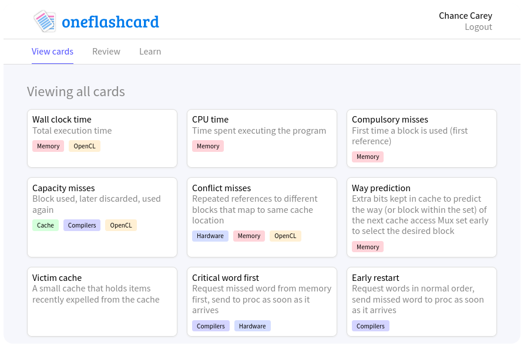

<div align="center">


[Documentation](#documentation) | [details](#server) | [Contributing](#contributing)

</div>



# Server

## Structure

The server is written in strict **Typescript** and uses [`Koa`](https://koajs.com/) (with [`koa-router`](https://github.com/ZijianHe/koa-router) and [`koa-bodyparser`](https://github.com/koajs/bodyparser) helpers) to provide a REST api. **Schema validation** is handled using [`Joi`](https://github.com/hapijs/joi). **Password encryption** and **validation** is performed using [`bcrypt`](https://www.npmjs.com/package/bcrypt) and `10` salt rounds. The database backend is **Postgres**, and is interacted with using [`knex`](https://knexjs.org).

The server is packaged for deployment using **Docker**. The build process is multi-stage and compiles the Typescript source into pure Javascript for later execution.

The Postgres database similarly has a Dockerfile for initial deployment - all migrations are packaged as part of the image.

## Testing


Full **integration testing** is used for the server. The [server/integration_tests.docker-compose.yml](server/integration_tests.docker-compose.yml) file starts and prepares the postgres database, builds and starts the server, and then builds and starts integration tests program.

The tests are run using **Jest**. Each test truncates every table in the database to ensure no contamination.

The tests can be run locally on a system that has `docker` and `docker-compose` installed via running:

```
$ ./server/utils.bash test
```

This will build each element and run the integration tests.

## Deployment


**Github Actions** are used to run the CICD workflow. Currently, each change / PR triggers a full run of the integration tests. The integration tests are run in an identical manner to how they would be run locally.

# Documentation

WIP.

# Contributing

This is a personal project, made public for demonstrative reasons.
